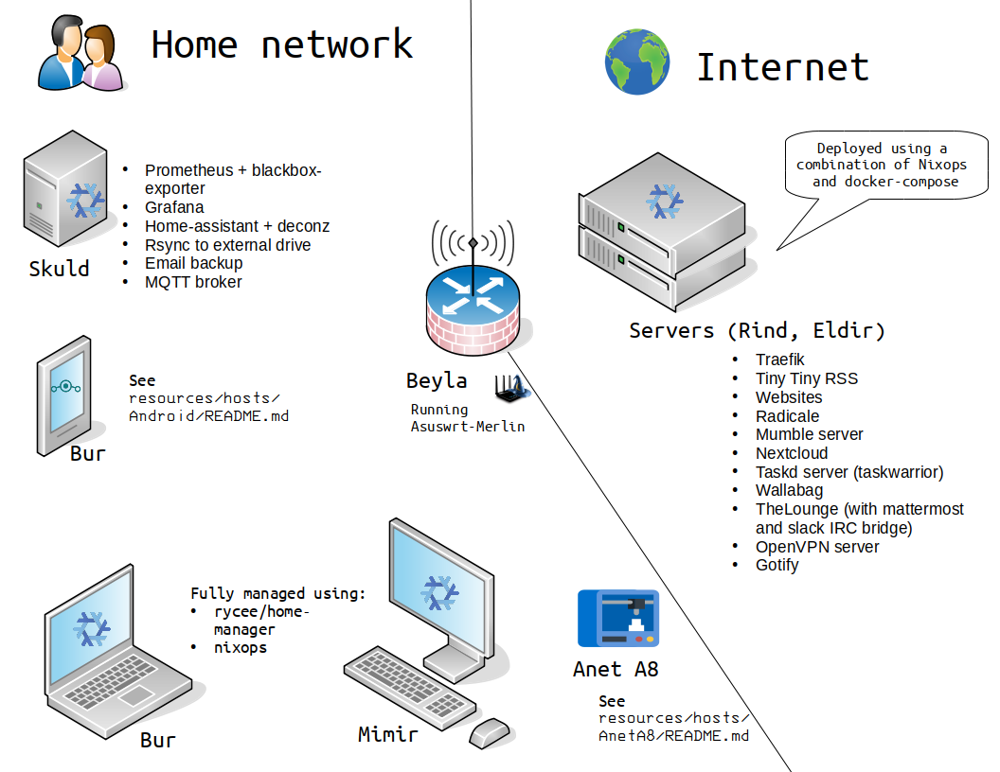

# Infrastructure

Over the years, I've built an infrastructure to fit all my needs:
- Be highly customisable
- Be open source and self-hosted whenever possible
- Be easily maintenable and reproductible

This repo includes all the informations and configurations I can share.

Here is an overview of my network made with OpenOffice Draw and the VRT Network Equipment extension.

## Repo architecture

- `dotfiles` contains dotfiles which will be copied as is by `home-manager`;
- `home` contains the configuration for `home-manager`;
- `modules` defines all the options that are used thoughout my configuration;
- `nixops` contains the declarations used by `nixops`;
- `nixos` contains my NixOS configuration;
- `nixpkgs` contains `nixpkgs` config and overlays;
- `resources` contains public options per host/profile or common throught my network;
- `scripts` contains a bunch of scripts used by my config or with keybindings;
- `vendor` contains dependencies including the private part of my configuration.

## Note

I've took a long time building this infrastructure, making it very customized. I wouldn't recommend trying to use it as is, as it would probably be more confusing than helpful. My hope is that this repo can give you some ideas to improve your own infrastructure!  

I would also love to have some feedback, feel free to contact me for suggestions, critics or informations.

## ToDo

This is still a work in progress. The followings need to be taken care of:
- [ ] Update Emacs Readme and move to LSP
- [ ] Fix bug with Wireguard client which sometimes need to be restarted manually
- [ ] Fix extract in Thunar
- [ ] Fix open in terminal in Thunar
- [ ] Configure xbanish
- [ ] Finalize polybar and use of theming variables
- [ ] Finalize automatic theme based on base16
- [ ] Finish Wireguard server

In the long term I also would like to move to Wayland/Sway but I've built a lot of dependencies with X tools so that probably won't happen in a near future.

## Donation

This project helped you ? You can buy me a cup of coffee  

