# NixOS Infrastructure

[](https://nixos.org)
[](https://github.com/LnL7/nix-darwin)
[](https://github.com/nix-community/home-manager)
[](https://github.com/serokell/deploy-rs)

Personal infrastructure configuration using NixOS, nix-darwin, and home-manager to manage multiple machines across different environments.


## ✨ Features

🖥️ **Multi-Platform Support**
- Linux: NixOS configurations with hardware-specific modules
- macOS: nix-darwin integration with Homebrew package management  
- Unified dotfiles and user environments via home-manager

🚢 **Deployment**
- Local deployments: Automatic detection and native rebuilds
- Remote deployments: deploy-rs integration with remote building
- Batch operations: Deploy to clusters or groups of machines
- Dry-run support: Test configurations before activation

🔧 **Modular Architecture**
- System-aware: Automatic Linux/Darwin configuration selection  
- Network-aware: Home, work, and cloud-specific settings
- Profile-based: PC vs server optimized configurations
- Cluster support: Kubernetes cluster with role-based configs

⭐ **Additional Features**
- Secret management: SOPS-nix integration for encrypted secrets
- Hardware optimization: nixos-hardware modules for different devices
- Version pinning: Separate nixpkgs channels for stability
- Reproducible system restoration

## 🏗️ Architecture

Each host is configured based on four attributes that determine which modules get loaded:

### 📐 Configuration Dimensions

```mermaid
graph TD
    A[Host Configuration] --> B[System]
    A --> C[Network]  
    A --> D[Profile]
    A --> E[Cluster]
    
    B --> B1[Linux/NixOS]
    B --> B2[Darwin/macOS]
    
    C --> C1[🏠 Home]
    C --> C2[🏢 Work] 
    C --> C3[☁️ Cloud]
    
    D --> D1[💻 PC]
    D --> D2[🖥️ Server]
    
    E --> E1[🎯 Standalone]
    E --> E2[☸️ K8s Cluster]
```



| Dimension | Purpose | Examples |
|-----------|---------|----------|
| **System** | Platform-specific optimizations | `linux`, `darwin` |
| **Network** | Environment-based configuration | `home`, `work`, `cloud` |
| **Profile** | Usage-pattern optimization | `PC`, `server` |
| **Cluster** | Multi-node coordination | `hades` (k8s), `""` (standalone) |

### 📁 Directory Structure

```
infrastructure/
├── 📄 flake.nix              # Main flake configuration
├── 📄 hosts.json             # Host definitions and attributes
├── 📁 nixos/                 # NixOS system configurations
│   ├── 📁 hosts/             # Per-host system configs
│   ├── 📁 networks/          # Network-specific modules  
│   ├── 📁 profiles/          # Profile-based optimization
│   └── 📁 system/            # Platform-specific base configs
├── 📁 home/                  # home-manager configurations
│   ├── 📁 hosts/             # Per-host user configs
│   ├── 📁 profiles/          # User profile templates
│   ├── 📁 dev/               # Development environment
│   └── 📄 apps.nix           # Application configurations
├── 📁 resources/             # Shared configuration data
├── 📁 dotfiles/              # Static configuration files
├── 📁 bin/                   # Deployment scripts
└── 📁 modules/               # Custom NixOS/home-manager modules
```

## 🚀 Quick Start

### Prerequisites

```bash
# Install Nix with flakes support
curl -L https://nixos.org/nix/install | sh -s -- --daemon
echo "experimental-features = nix-command flakes" | sudo tee -a /etc/nix/nix.conf
```

### Clone & Setup

```bash
# Clone with submodules
git clone --recurse-submodules https://github.com/yourusername/infrastructure.git
cd infrastructure

# Enter development shell
nix develop

# View available deployment commands
deploy-help
```

### First Deployment

```bash
# Local deployment (auto-detected)
deploy-mimir

# Remote deployment via deploy-rs  
deploy .#orion

# Deploy entire cluster
deploy-hades

# Dry run (test without activation)
deploy-vali --dry
```

## ⚙️ Host Configuration

Each host is defined in [`hosts.json`](./hosts.json) with its configuration attributes:

```json
{
  "mimir": {
    "hostname": "mimir",
    "profile": "PC", 
    "network": "home",
    "user": "gregoire",
    "cluster": "",
    "clusterRole": ""
  },
  "hades-1": {
    "hostname": "hades-1",
    "profile": "server",
    "network": "home", 
    "user": "gregoire",
    "cluster": "hades",
    "clusterRole": "server"
  }
}
```

### Adding a New Host

1. **Add host definition** to `hosts.json`
2. **Create host-specific configs**:
   ```bash
   mkdir -p nixos/hosts/newhost
   mkdir -p home/hosts/newhost  
   mkdir -p resources/hosts/newhost
   ```
3. **Add to flake.nix** nixosConfigurations or darwinConfigurations
4. **Create deployment script**: `bin/deploy-newhost`

## 🚢 Deployment Commands

The deployment scripts automatically detect local vs remote deployments:

### Individual Hosts
```bash
deploy-mimir        # Gaming/workstation (home network)  
deploy-vali         # Laptop (home network)
deploy-orion        # Cloud server
deploy-datadog      # Work MacBook
```

### Cluster Deployments  
```bash
deploy-hades        # Kubernetes cluster (6x Raspberry Pi 4)
deploy-local        # All home development machines
deploy-work         # Work machines
deploy-all          # All hosts
```

### Options
```bash
deploy-mimir --dry              # Build-only test
deploy .#orion --skip-checks    # Skip flake evaluation
deploy .# --help               # Deploy-rs options
```

## 🔧 Development Workflow

### Local Development
```bash
# Enter development shell
nix develop

# Test configuration changes
nixos-rebuild build --flake .#hostname

# Apply changes locally  
sudo nixos-rebuild switch --flake .#hostname
```

### Remote Development
```bash
# Test on remote host
deploy .#hostname --dry-activate

# Deploy to remote
deploy .#hostname

# Rollback if needed (deploy-rs magic!)
deploy .#hostname --rollback
```

### Configuration Management
```bash
# Update flake inputs
nix flake update

# Check system health
deploy .# --dry-activate

# View deployment diff
nix profile diff-closures --profile /nix/var/nix/profiles/system
```

## 🌐 Network Environments

### 🏠 Home Network
- **Features**: Full GUI, gaming, development tools
- **Hardware**: Desktop PCs, laptops, Raspberry Pi cluster  
- **Services**: Self-hosted infrastructure, NAS, monitoring

### 🏢 Work Network  
- **Features**: Corporate compliance, restricted package sets
- **Hardware**: Managed MacBooks with nix-darwin
- **Integration**: Company SSO, VPN, security policies

### ☁️ Cloud Network
- **Features**: Minimal server profiles, automated deployment
- **Providers**: Hetzner, DigitalOcean, custom VPS
- **Services**: Web hosting, CI/CD, backup storage

## 👥 Profiles

### 💻 PC Profile
- **Desktop Environment**: i3wm with polybar (Linux), Aerospace + SketchyBar (macOS)  
- **Development Stack**: Emacs with Doom, Python/Rust/Go toolchains
- **Applications**: Firefox, media tools, gaming (Steam)
- **Hardware**: Audio/video optimization, GPU drivers

### 🖥️ Server Profile  
- **Minimalism**: No GUI, documentation disabled
- **Services**: Docker, k3s, monitoring stack
- **Security**: Hardened SSH, firewall, automated updates
- **Efficiency**: Resource-optimized package selection

## ☸️ Kubernetes Integration

The **Hades cluster** is a Kubernetes cluster managed by this configuration:

```bash
# Deploy k8s master node
deploy-hades-1

# Deploy worker nodes  
deploy-hades-2 deploy-hades-3 deploy-hades-4 deploy-hades-5 deploy-hades-6

# Or deploy entire cluster
deploy-hades
```

### 🔧 Cluster Features
- **Hardware**: 6x Raspberry Pi 4 (4GB RAM)
- **Networking**: Tailscale mesh, internal load balancing
- **Storage**: Distributed storage with persistent volumes
- **Monitoring**: Prometheus + Grafana stack
- **Applications**: Self-hosted services, CI/CD runners

## 🔐 Secrets Management

Secrets are managed using [SOPS](https://github.com/Mic92/sops-nix):

```bash
# Edit secrets
sops secrets/hosts/hostname/secrets.yaml

# Deploy with secrets
deploy .#hostname  # Secrets automatically decrypted on target
```

### Secret Structure
```yaml
# secrets/hosts/mimir/secrets.yaml
wifi_password: ENC[AES256_GCM,data:...,tag:...]
ssh_private_key: ENC[AES256_GCM,data:...,tag:...]
```

## 📚 Documentation

- **[Installation Guide](INSTALLING.md)**: Detailed setup instructions
- **[NixOS Setup](NIXOS.md)**: NixOS-specific configuration notes
- **[Hardware Guide](resources/hosts/)**: Hardware-specific configurations
- **[Network Diagrams](diagrams/)**: Infrastructure topology

## 🤝 Contributing

This repository represents a personal infrastructure that has evolved over years of usage. While it's highly customized for specific needs, it can serve as inspiration for your own Nix infrastructure.

### Getting Ideas
- Browse the [modules/](modules/) for reusable configuration patterns
- Check [home/dev/](home/dev/) for application configurations  
- Look at [nixos/profiles/](nixos/profiles/) for system optimization examples

### Providing Feedback
- **Issues**: Report bugs or suggest improvements
- **Discussions**: Share ideas or ask questions  
- **Pull Requests**: Contribute fixes or enhancements

## 📊 Statistics

```
Managed Hosts: 10+
Supported Platforms: NixOS (x86_64, aarch64), macOS (Apple Silicon)
Configuration Files: 100+ Nix modules
Deployment Targets: Home, Work, Cloud
Cluster Nodes: 6x Raspberry Pi 4
```

## 🏆 Acknowledgments

- **[NixOS](https://nixos.org)**: The purely functional Linux distribution
- **[home-manager](https://github.com/nix-community/home-manager)**: Declarative dotfiles management  
- **[deploy-rs](https://github.com/serokell/deploy-rs)**: Multi-host deployment tooling
- **[nixos-hardware](https://github.com/NixOS/nixos-hardware)**: Hardware-specific optimizations

## ☕ Support

This project helped you build your infrastructure? 

[](https://www.paypal.com/cgi-bin/webscr?cmd=_s-xclick&hosted_button_id=EWHGT3M9899J6)

---

Built with ❤️ using Nix